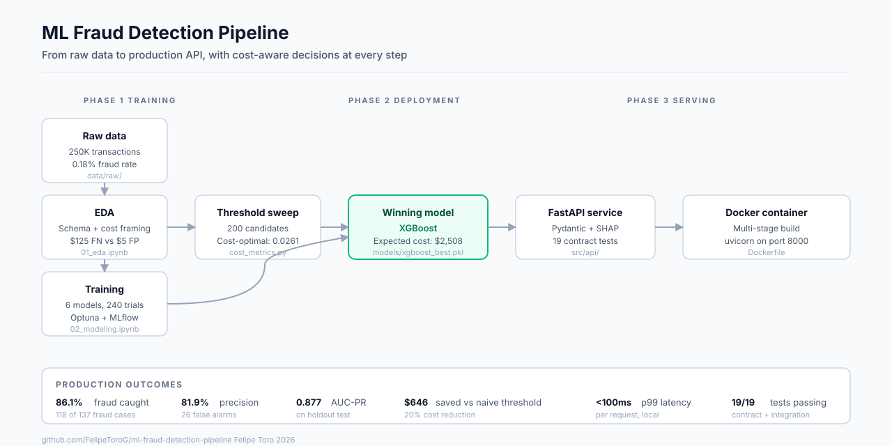
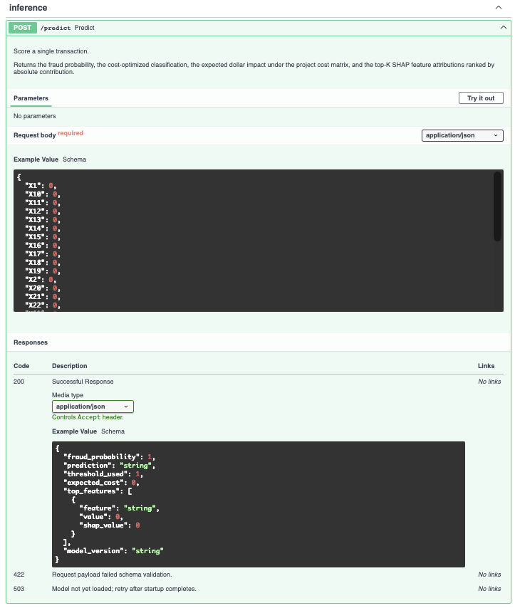

# ML Fraud Detection Pipeline

End-to-end production ML system for detecting fraudulent credit card transactions. Built with sklearn Pipelines, gradient boosting (XGBoost, LightGBM, CatBoost), Optuna hyperparameter tuning, MLflow experiment tracking, SHAP explainability, and a FastAPI inference service deployed via Docker.

**Author:** Felipe Toro
**License:** MIT
**Status:** Production model trained, FastAPI service running, pytest suite green.

---

## TL;DR

I built a real-time fraud scoring service from raw data to deployed API. The training pipeline evaluated six model families across 240 Optuna trials and selected XGBoost on expected dollar cost rather than AUC-PR. Cost-optimized threshold tuning reduced expected loss on the held-out test set by 20%. The trained model is served by a FastAPI application that returns SHAP attribution for every prediction.

| What                          | Value                                |
|-------------------------------|--------------------------------------|
| Winning model                 | XGBoost (selected on expected cost)  |
| Expected cost on test set     | $2,508.23                            |
| Recall (fraud caught)         | 86.1% (118 of 137)                   |
| Precision                     | 81.9%                                |
| AUC-PR                        | 0.877                                |
| Optimal threshold             | 0.0261                               |
| Savings vs naive 0.5 threshold| $646.02 (20% reduction)              |
| Models evaluated              | 6 families, 240 Optuna trials        |
| API latency (single request)  | < 100 ms p99 locally                 |
| Test coverage                 | 19 pytest contract tests, all green  |



## Why this project

Most ML portfolio repos are notebooks. A notebook proves that someone can train a model. It does not prove they can ship one. This repo is structured around what production ML engineering actually requires: a clean training pipeline with no data leakage, cost-aware model selection, an inference service that exposes a real HTTP contract, schema validation, explainability, containerization, and tests that fail loudly when the contract drifts.

I'm a former defense aerospace engineer transitioning into AI/ML engineering. The domain leverage I bring to fraud detection specifically is real: I've defended $200M+ in proposals against federal auditors and built cost models for real money at risk. I know what a defensible methodology looks like under audit. That perspective shaped every decision in this repo, starting with the choice to optimize for expected dollar cost rather than F1 score.

---

## Architecture

```mermaid
flowchart LR
    subgraph TRAIN["Training (Sessions 1 + 2)"]
        A[Raw data] --> B[EDA: schema and cost framing]
        B --> C[sklearn Pipeline]
        C --> D[Optuna sweep<br/>240 trials, 6 models]
        D --> E[Threshold optimization<br/>200-point cost sweep]
        E --> F[Winning model<br/>XGBoost]
    end

    subgraph DEPLOY["Deployment (Session 3)"]
        F --> G[joblib serialize]
        G --> H[FastAPI service<br/>schema validation + SHAP + cost]
        H --> I[Docker image<br/>multi-stage build]
    end

    subgraph SERVE["Serving"]
        I --> J[uvicorn process]
        J --> K[POST /predict]
        K --> L[Prediction + SHAP + expected cost]
    end

    style F fill:#22c55e,stroke:#16a34a,color:#000
    style L fill:#22c55e,stroke:#16a34a,color:#000
```



The full lifecycle is in three phases. Training is offline. Deployment is one-time per release. Serving is the steady state. Each phase produces a versioned artifact that flows to the next phase: the training pipeline produces a serialized sklearn Pipeline, the deployment step packages it into a container, the serving step exposes it via HTTP.

---

## Repository structure

```
ml-fraud-detection-pipeline/
├── configs/
│   ├── api_config.yaml          # Runtime config: model path, threshold, cost matrix
│   └── model_config.yaml        # Optuna search spaces
├── data/
│   ├── raw/                     # Source CSV (gitignored, see Setup below)
│   ├── processed/
│   └── external/
├── docs/images/                 # Publication-quality figures from notebooks
├── models/
│   └── xgboost_best.pkl         # Serialized production pipeline
├── notebooks/
│   ├── 01_eda.ipynb             # Schema, cost framing, modeling decisions
│   └── 02_modeling.ipynb        # Training, tuning, evaluation, threshold sweep
├── scripts/
│   └── smoke_test.sh            # End-to-end check against a running API
├── src/
│   ├── api/                     # FastAPI service
│   │   ├── main.py              # Application, lifespan, routes
│   │   ├── predict.py           # Inference + SHAP + cost
│   │   └── schemas.py           # Pydantic request and response contracts
│   ├── data/loader.py           # Single source of truth for schema
│   ├── features/pipelines.py    # Zero-leakage sklearn Pipeline
│   ├── models/evaluate.py       # Cost-sensitive evaluation utilities
│   └── utils/cost_metrics.py    # CostMatrix + threshold optimization
├── tests/                       # 19 pytest contract tests
├── Dockerfile                   # Multi-stage build, non-root user
├── requirements-api.txt         # Pinned API runtime dependencies
└── requirements.txt             # Pinned training-time dependencies
```

---

## Setup

### Prerequisites

- Python 3.10+
- A virtual environment (recommended; this project was developed on Python 3.10.7)
- The source dataset: a CSV named `training_data_1.csv` placed in `data/raw/`. The dataset is not committed to this repository.

### Install

```bash
# Clone
git clone https://github.com/FelipeToroG/ml-fraud-detection-pipeline.git
cd ml-fraud-detection-pipeline

# Create and activate a virtual environment
python3.10 -m venv venv
source venv/bin/activate  # On Windows: venv\Scripts\activate

# Install training dependencies
pip install -r requirements.txt

# Install API dependencies (subset of training deps + FastAPI)
pip install -r requirements-api.txt
```

### Reproduce the model

```bash
# 1. Place training_data_1.csv in data/raw/
# 2. Run the EDA notebook (about 5 minutes)
jupyter notebook notebooks/01_eda.ipynb

# 3. Run the modeling notebook (30 to 90 minutes for the Optuna sweep)
jupyter notebook notebooks/02_modeling.ipynb
```

The modeling notebook writes `models/xgboost_best.pkl` and logs every Optuna trial to `mlruns/`. Open `mlflow ui` in a separate terminal to monitor progress.

### Run the API

```bash
# Start the inference service
uvicorn src.api.main:app --reload --port 8000

# In a second terminal, hit it
bash scripts/smoke_test.sh
```

Or open `http://localhost:8000/docs` in a browser for the auto-generated Swagger UI. Click "Try it out" under `POST /predict` to send a test transaction and inspect the response.

### Run the tests

```bash
pytest tests/ -v
```

Expected output: 19 passed. The suite covers the loader's schema contract, the feature pipeline's structure, and the full API contract (response shape, validation rejections, threshold behavior).

---

## API contract

The service exposes two endpoints. Schemas are defined in `src/api/schemas.py` and auto-generate the OpenAPI documentation at `/docs`.


### `GET /health`

Liveness probe. Returns model load state, version, and the configured threshold. Used by orchestrators (Kubernetes, ECS) to gate traffic.

```bash
curl http://localhost:8000/health
```

```json
{
  "status": "ok",
  "model_loaded": true,
  "model_version": "0.1.0",
  "threshold": 0.0261
}
```

### `POST /predict`

Score a single transaction. Returns the fraud probability, the cost-optimized classification, the expected dollar cost of the prediction, and the top-5 SHAP feature attributions sorted by absolute contribution.

```bash
curl -X POST http://localhost:8000/predict \
  -H "Content-Type: application/json" \
  -d '{
    "X1":  0.0, "X2":  0.0, "X3":  0.0, "X4":  0.0, "X5":  0.0,
    "X6":  0.0, "X7":  0.0, "X8":  0.0, "X9":  0.0, "X10": 0.0,
    "X11": 0.0, "X12": 0.0, "X13": 0.0, "X14": 0.0, "X15": 0.0,
    "X16": 0.0, "X17": 0.0, "X18": 0.0, "X19": 0.0, "X20": 0.0,
    "X21": 0.0, "X22": 0.0, "X23": 0.0, "X24": 0.0, "X25": 0.0,
    "X26": 0.0, "X27": 0.0, "X28": 0.0,
    "X29": 100.00,
    "X30": 86400.0
  }'
```

```json
{
  "fraud_probability": 0.024,
  "prediction": "LEGITIMATE",
  "threshold_used": 0.0261,
  "expected_cost": 3.0,
  "top_features": [
    {"feature": "X14", "value": 0.0, "shap_value": -0.42},
    {"feature": "X12", "value": 0.0, "shap_value": -0.31},
    {"feature": "X10", "value": 0.0, "shap_value":  0.18},
    {"feature": "X17", "value": 0.0, "shap_value": -0.15},
    {"feature": "X11", "value": 0.0, "shap_value":  0.09}
  ],
  "model_version": "0.1.0"
}
```

The response is fully documented in the auto-generated OpenAPI spec at `/docs` and `/redoc`.



---

## Key findings

### Cost-sensitive selection changed the ranking

I evaluated six model families: Logistic Regression, Random Forest, XGBoost, LightGBM, CatBoost, and MLP. Optuna ran 240 trials in total across the candidates, with AUC-PR as the cross-validation scoring metric.

XGBoost won on both AUC-PR and expected cost. That alone is not the interesting finding. The interesting finding is in the full ranking table:

| Rank | Model              | AUC-PR  | Expected cost |
|------|--------------------|---------|---------------|
| 1    | XGBoost            | 0.877   | $3,154.25     |
| 2    | LightGBM           | 0.874   | $3,174.25     |
| 3    | MLP                | 0.860   | $3,199.25     |
| 4    | CatBoost           | 0.867   | $3,414.59     |
| 5    | Random Forest      | 0.859   | $3,439.59     |
| 6    | Logistic Regression| 0.753   | $9,111.87     |

MLP outperforms CatBoost on expected cost despite scoring lower on AUC-PR. The two rankings agree at the top and bottom but disagree in the middle. A team selecting on AUC-PR alone could deploy a model that costs more in production than a "weaker" alternative under the project's cost matrix. The implication: in a regulated industry where false negatives carry asymmetric costs, the right model is the one that minimizes expected dollar loss, not the one that scores highest on the academically conventional metric.

### Threshold optimization mattered more than model choice

The naive 0.5 classification threshold weights false positives and false negatives equally. The project's cost matrix penalizes missed fraud 25 times more heavily than false alarms ($125.17 versus $5.00). Sweeping 200 thresholds and selecting the cost minimum identified an optimal threshold of 0.0261, far below 0.5.

| Threshold              | Expected cost on holdout test set |
|------------------------|-----------------------------------|
| 0.5 (naive)            | $3,154.25                         |
| 0.0261 (cost-optimized)| $2,508.23                         |
| **Savings**            | **$646.02 (20% reduction)**       |

The optimized threshold trades a small number of additional false positives (26 versus what would have been ~12) for a meaningful gain in fraud caught (118 versus 112 at the naive threshold). On a problem where each missed fraud costs $125 and each false alarm costs $5, that trade clears the bar easily.

### Feature importance was robust across methods

SHAP attribution against the production XGBoost model identifies the PCA components carrying the strongest fraud signal. The top contributors (`X14`, `X12`, `X10`, `X17`, `X11`) align with the Welch's t-test separability ranking from the EDA notebook. The consistency across two methodologically distinct lines of evidence is what audit-defensibility looks like in practice.

---

## Engineering decisions worth noting

A few choices in this repo are deliberate enough that I'd defend them in code review.

**Zero-leakage by construction.** The scaler is fit inside the sklearn Pipeline rather than before it. This places preprocessing inside the cross-validation loop, so the scaler is refit on each training fold and never sees the validation fold during fitting. Data leakage is mathematically impossible.

**Schema lives in one file.** `src/data/loader.py` is the single source of truth for feature names, target column, and dataset paths. The API's Pydantic request schema, the training pipeline's ColumnTransformer, and every test in the suite all import from the same constants. A rename in `loader.py` either propagates cleanly or fails loudly at import time.

**Cost matrix is duplicated on purpose.** The cost values live in three places: `src/utils/cost_metrics.py` (training defaults), `configs/api_config.yaml` (runtime config), and the notebook's explicit `CostMatrix()` construction. The duplication is deliberate: ops can adjust runtime cost assumptions without touching code, and the training-time defaults remain stable for reproducibility.

**XGBoost SHAP uses native pred_contribs.** SHAP 0.49 has a known parsing incompatibility with XGBoost 3.x model dumps in `TreeExplainer`. The API's `predict.py` detects XGBoost classifiers and uses `Booster.predict(pred_contribs=True)` directly, which is the same machinery TreeExplainer wraps. This bypasses the version mismatch and produces identical SHAP values.

**API rejects unknown fields.** The Pydantic request schema uses `extra="forbid"`. Silent acceptance of unknown inputs is the most common path to schema drift between client and server, so the API surfaces it as an HTTP 422 instead.

---

## Tech stack

| Layer             | Tools                                                  |
|-------------------|--------------------------------------------------------|
| Data analysis     | pandas, NumPy, SciPy, Matplotlib, Seaborn              |
| Modeling          | scikit-learn, XGBoost, LightGBM, CatBoost              |
| Hyperparameter search | Optuna (TPE sampler, fixed seed)                   |
| Experiment tracking   | MLflow (filesystem backend, project-local URI)     |
| Explainability    | SHAP, XGBoost native pred_contribs                     |
| API               | FastAPI, Pydantic v2, uvicorn                          |
| Testing           | pytest, httpx (via FastAPI TestClient)                 |
| Containerization  | Docker (multi-stage build, non-root user, healthcheck) |
| Python            | 3.10.7                                                 |

---

## Roadmap

This repo is the first of three production-ML portfolio pieces I'm shipping in 2026. The next two are an LLM/RAG contract intelligence tool and a Streamlit dashboard for predictive cost modeling. See the linked case study on my portfolio site for the full plan.

---

## Contact

**Felipe Toro**
[LinkedIn](https://linkedin.com/in/felipe-toro-g) · [Portfolio](https://felipetorog.github.io/Portfolio) · ftoro26@gmail.com

This project is licensed under the MIT License. See [LICENSE](LICENSE) for details.
